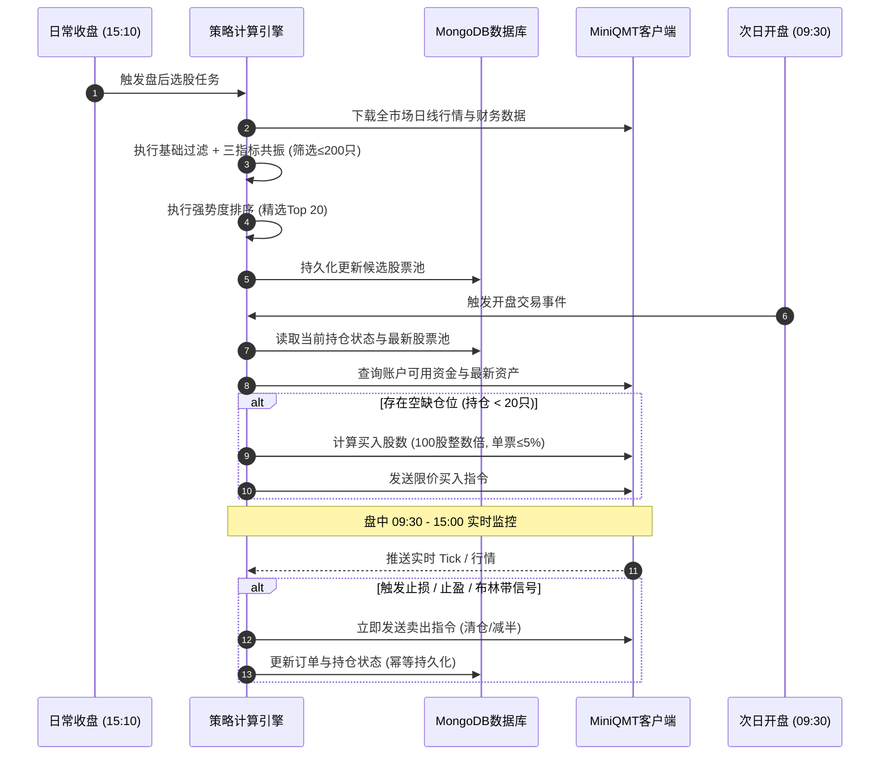

# A股量化交易策略（完整版）技术说明书

> **策略版本**：v1.0.0  
> **适用标的**：A股全市场（主板 / 创业板 / 科创板）  
> **核心逻辑**：多因子技术共振选股 → 四维强势度精选 → BOLL-RB布林带持仓跟踪 → 分档止盈与动态止损  
> **底层框架**：迅投 MiniQMT (`xtquant`) + MongoDB (`MongoEngine`)

---

## 一、策略核心概述

| 维度 | 规范与参数 | 说明 |
| :--- | :--- | :--- |
| **适用市场** | A股全市场 | 排除ST、*ST、退市整理、次新股(<30日)、停牌、涨跌停标的 |
| **交易逻辑** | 多因子选股 → 强势股精选 → 布林带持仓管理 → 严格止盈止损 | 全流程量化规则驱动，杜绝主观情绪干扰 |
| **股票池容量** | 股票池 $\le 200$ 只 | 每日收盘后基于流动性与三指标共振筛选 |
| **持仓容量** | 最终持仓 $\le 20$ 只 | 单票仓位 $\le 5\%$，分散持仓以有效平滑组合回撤 |
| **调仓周期** | 日频（收盘后选股，次日开盘调仓） | 盘中对持仓标的进行实时止损止盈与布林带信号监控 |

---

## 二、第一步：股票池筛选（$\le 200$ 只）

### 1. 基础安全与流动性过滤（硬性前置过滤）
每日收盘后，遍历A股全市场标的，首先剔除不符合流动性与安全要求的股票：
1. **剔除ST、*ST、退市风险股**：避免遭遇重大财务造假或非标审计导致的退市黑天鹅。
2. **剔除上市不足30日次新股**：次新股筹码沉淀不足、估值波动剧烈，技术指标往往失真。
3. **剔除当日停牌、涨停/跌停无法交易个股**：保证策略的可执行性与撮合流动性。
4. **剔除近20日日均成交额 $< 1$ 亿元的个股**：确保资金容量与进出自由度，避免流动性折价与冲击成本。

---

### 2. 三大技术指标共振选股
在通过基础过滤的标的中，必须**同时满足以下三大技术指标金叉/突破条件**，方可纳入备选股票池：

#### （1）成交量条件（量能均线金叉）
- **指标定义**：5日成交量均线（MAVOL5）上穿 38日成交量均线（MAVOL38）。
- **判定公式**：
  $$\begin{cases} MAVOL(5)_{t} > MAVOL(38)_{t} \\ MAVOL(5)_{t-1} \le MAVOL(38)_{t-1} \end{cases}$$
- **市场含义**：短期量能明显放大并有效突破中期均量线，表明主力增量资金正在进场建仓。

#### （2）RSI条件（强弱指标突破55分水岭）
- **指标定义**：14日相对强弱指标（RSI14）向上突破 55 强势临界线。
- **判定公式**：
  $$\begin{cases} RSI(14)_{t} > 55 \\ RSI(14)_{t-1} \le 55 \end{cases}$$
- **市场含义**：RSI站上55表明个股摆脱震荡盘整区，多方力量占据明显主导地位。

#### （3）OBV能量潮条件（OBV上穿均线）
- **指标定义**：OBV累积能量潮上穿其30日移动平均线（MAOBV30）。
- **判定公式**：
  $$\begin{cases} OBV_{t} > MA(OBV, 30)_{t} \\ OBV_{t-1} \le MA(OBV, 30)_{t-1} \end{cases}$$
- **市场含义**：量价配合良好，筹码呈净流入状态，能量潮趋势确立。

---

### 3. 股票池数量控制与截断
- 若当天满足三大共振条件的个股数量 $> 200$ 只，则构建综合评分模型：
  $$\text{Score} = w_1 \cdot \text{Rank}(\text{5日涨幅}) + w_2 \cdot \text{Rank}(\text{成交额}) + w_3 \cdot \text{Rank}(\text{换手率})$$
- 按照综合评分从高到低排序，**截取前 200 只股票**作为基础股票池。

---

## 三、第二步：精选强势股（$\le 20$ 只买入）

在上述 $\le 200$ 只股票池中，按照**强势度优先级**进行二次精选，挑选前 20 只执行买入配置：

### 1. 强势股筛选标准（按优先级从高到低）

```mermaid
flowchart TD
    A[200只共振股票池] --> B{1. 收盘价 > 20日均线 (MA20)}
    B -- 否 --> X[剔除]
    B -- 是 --> C{2. 近5日涨幅 > 0%}
    C -- 否 --> X
    C -- 是 --> D{3. 换手率介于 3% ~ 10%}
    D -- 否 --> X
    D -- 是 --> E{4. 流通市值介于 100亿 ~ 3000亿}
    E -- 否 --> X
    E -- 是 --> F[强势候选池排序]
    F --> G[选取Top 20执行买入 (单票≤5%)]
```

1. **收盘价站上 20 日均线**：$Close > MA(Close, 20)$，确保处于中期上升趋势线上方。
2. **近 5 日涨幅 $> 0$**：剔除短期处于连续回踩状态的个股，确保短期动量向上。
3. **换手率介于 $3\% \sim 10\%$**：活跃度适中。换手率 $< 3\%$ 缺乏主力关注；换手率 $> 10\%$ 则存在筹码分散与游资高位出逃风险。
4. **流通市值介于 100 亿 $\sim$ 3000 亿元**：规避 100 亿以下易被操纵的小盘庄股，同时剔除 3000 亿以上弹性较弱的超大盘蓝筹。

### 2. 仓位与资金管理
- **单只个股仓位上限**：$\le 5\%$ 总资产。
- **最大持仓标的数量**：$\le 20$ 只。
- **资金配置原则**：等权重分配（每只建仓资金为总资金的 $5\%$），预留部分现金作为调仓缓冲。

---

## 四、第三步：持仓管理——BOLL-RB布林带策略

对已建仓的持仓标的，使用布林带（Bollinger Bands, BOLL）进行动态跟踪，作为日常持仓与减仓的依据。

### 1. 参数设定
- **周期参数**：$N = 20$ 日
- **标准差倍数**：$K = 2$
- **轨线计算公式**：
  - **中轨**：$MID = MA(Close, 20)$
  - **上轨**：$UP = MID + 2 \times \sigma(Close, 20)$
  - **下轨**：$LOW = MID - 2 \times \sigma(Close, 20)$

### 2. 持仓操作规则

| 市场形态 | 判定条件 | 操作动作 | 说明 |
| :--- | :--- | :--- | :--- |
| **强势持有** | $MID < Close \le UP$ | **继续持股** | 股价运行在布林通道上半区，上升趋势良好 |
| **警惕减仓** | ① 股价触碰/突破上轨后回落（$High \ge UP$ 且 $Close < UP$）<br>② 跌破中轨（$Close < MID$ 且 $Close_{t-1} \ge MID_{t-1}$） | **减仓 1/2** | 趋势动能衰竭或出现短期回调迹象，主动收缩风险敞口 |
| **清仓离场** | 股价有效跌破下轨（$Close < LOW$） | **全部卖出 (清仓)** | 趋势彻底破位，进入加速下行通道，无条件清仓 |

---

## 五、第四步：止损止盈规则（硬性执行）

严格的纪律性风控是量化策略长期稳定盈利的生命线。

```mermaid
graph TD
    Start[持仓标的实时监控] --> SL{现价 ≤ 成本价 * (1 - 7%)}
    SL -- 是 --> ActionSL[硬止损: 立即市价全部清仓]
    SL -- 否 --> TP1{盈利 ≥ 15%}
    
    TP1 -- 是 --> ActionTP1[第一止盈: 卖出 1/2 仓位<br/>止损线上调至 成本价 + 3%]
    TP1 -- 否 --> DynamicCheck[检查动态止损与布林带]

    ActionTP1 --> TP2{盈利 ≥ 30%}
    TP2 -- 是 --> ActionTP2[第二止盈: 再卖出剩余 1/2 仓位<br/>止损线上调至 成本价 + 10%]
    TP2 -- 否 --> DynamicCheck

    ActionTP2 --> TrackRest[剩余仓位跟踪]
    TrackRest --> CheckMID{跌破布林中轨 Close < MID}
    CheckMID -- 是 --> ActionClear[清仓剩余全部底仓]
```

### 1. 固定止损（硬性风控）
- **止损线**：当前价格 $\le \text{买入成本价} \times (1 - 7\%)$。
- **执行逻辑**：触发后立即执行市价卖出，严禁主观犹豫、严禁补仓摊平成本。

### 2. 分档止盈（落袋为安）
- **第一档止盈（+15%）**：个股盈利达到 $+15\%$ 时，**主动卖出 $1/2$ 仓位**。
- **第二档止盈（+30%）**：个股盈利达到 $+30\%$ 时，**再卖出剩余持仓的 $1/2$**（即初始建仓的 $1/4$）。
- **剩余底仓跟踪**：剩余仓位继续由布林带策略跟踪，一旦收盘价或盘中**跌破布林中轨（$Close < MID$）**，立即将剩余底仓全部卖出，完成一轮完整交易闭环。

### 3. 动态止损（利润保护机制）
为防止大幅盈利后回撤侵蚀本金，在盈利不同阶段动态上移止损线：
- **阶段一**：个股最高盈利 $> 15\%$ 后，**止损线强制上移至「成本价 $+ 3\%$」**（锁定保本盈利离场）。
- **阶段二**：个股最高盈利 $> 30\%$ 后，**止损线强制上移至「成本价 $+ 10\%$」**（确保锁定核心利润）。

---

## 六、策略调仓与交易执行流程



### 1. 调仓周期与频次
- **每日盘后（15:10 以后）**：
  - 更新全市场日线行情数据；
  - 运行过滤模型与三指标共振算法，生成 $\le 200$ 只候选池；
  - 计算强势指标并完成排序，生成次日优先买入清单。
- **次日开盘（09:30）**：
  - 根据账户可用资金与当前实际持仓数量，在开盘集合竞价或开盘前 5 分钟内执行买入下单，补足空缺仓位至 $\le 20$ 只。
- **盘中实时监控（09:30 - 15:00）**：
  - 实时订阅持仓股票的 Tick / 1分钟行情；
  - 触发固定止损（$-7\%$）、分档止盈（$+15\% / +30\%$）、动态保本线（$+3\% / +10\%$）或布林带破位时，即时生成卖出委托。
- **月末复核**：
  - 每月最后一个交易日收盘后，对全局股票池及持仓表现进行全量复核与清洗，剔除基本面发生重大恶化或长期横盘滞涨标的。

---

## 七、MiniQMT (xtquant) 代码开发映射指南

根据项目 `AGENTS.md` 规范，实现本策略时应遵循以下架构与技术要点：

### 1. 文件与编码规范
- 所有 Python 源码文件第一行必须声明 `# coding=gbk`。
- 遵循 Type Hints 与标准中文 Docstring。

### 2. 核心指标计算函数设计（示例）
```python
# coding=gbk
import pandas as pd
import numpy as np

def calculate_ma_vol_cross(df_vol: pd.DataFrame) -> pd.Series:
    """
    计算5日均量线与38日均量线金叉
    """
    ma5 = df_vol['volume'].rolling(5).mean()
    ma38 = df_vol['volume'].rolling(38).mean()
    cross_condition = (ma5 > ma38) & (ma5.shift(1) <= ma38.shift(1))
    return cross_condition

def calculate_rsi(series_close: pd.Series, period: int = 14) -> pd.Series:
    """
    计算相对强弱指标 RSI
    """
    delta = series_close.diff()
    gain = delta.clip(lower=0)
    loss = -delta.clip(upper=0)
    avg_gain = gain.rolling(period).mean()
    avg_loss = loss.rolling(period).mean()
    rs = avg_gain / (avg_loss + 1e-9)
    rsi = 100 - (100 / (1 + rs))
    return rsi

def calculate_obv(df: pd.DataFrame) -> pd.DataFrame:
    """
    计算能量潮 OBV 及其 30 日均线
    """
    direction = np.sign(df['close'].diff().fillna(0))
    obv = (direction * df['volume']).cumsum()
    ma_obv = obv.rolling(30).mean()
    return obv, ma_obv

def calculate_boll(df: pd.DataFrame, n: int = 20, k: float = 2.0):
    """
    计算布林带 (BOLL)
    """
    mid = df['close'].rolling(n).mean()
    std = df['close'].rolling(n).std(ddof=0)
    up = mid + k * std
    low = mid - k * std
    return mid, up, low
```

### 3. 下单与防重约束
- **买入整百股校验**：`volume = int((target_amount / price) // 100) * 100`。
- **价格精度**：所有下单价格使用 `round(price, 2)`。
- **防重复触发**：通过内存字典 `dict_trading_flags[stock_code]` 与 MongoDB 持仓状态校验，避免高频 Tick 下单风暴。

---

## 八、风险提示与实盘注意事项

1. **纯技术面模型局限**：本策略基于量价技术因子构建，未整合深度财务基本面与宏观流动性分析，在系统性熊市或大盘极度缩量分化时可能出现连续假突破。
2. **A股 T+1 交易规则约束**：当天买入的股票无法日内卖出。若个股在上午买入后日内巨幅跳水触发 $-7\%$ 止损，必须顺延至次日开盘才能执行止损。建议结合尾盘买入（如 14:45 以后）以降低日内波动风险。
3. **流动性与滑点冲击**：虽然设定了 1 亿元成交额与 100 亿市值门槛，但在市场流动性骤降时，市价单卖出可能产生额外滑点，建议实盘中采用最优五档即时成交剩余撤销或限价加滑点方式报单。
4. **系统网络与客户端依赖**：MiniQMT 依赖本地 Windows 客户端存活，实盘应部署异常断线重连（`on_disconnected` 回调）与微信/钉钉告警通知。
